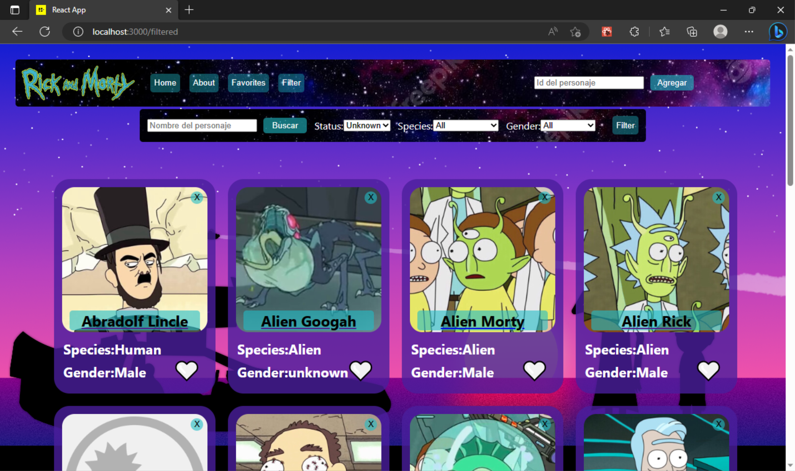

# **RICK Y MORTY APP** 

# **Henry** | Proyecto Integrador

## **Descripción**

App desarrollada como practica en las clases de los modulos 2, 3 y 4 de la carrera full stack developer de Henry
Esta app no tiene base de datos, se conecta a la api de Rick y Morty

<br />

---

## **Funcionalidades**


En la app se puede:
- Ver la información de distintos personajes de la serie Rick and Morty a travez de una card

Estas card se pueden:
- Filtrar y ordenar por: Especie, Status, Genero.
- Buscar por el nombre del personaje
- Agregar a una lista de favoritos p

<br />

---


## **Tecnologias usadas**

- React
- Redux
- Express
- Sequalize

<br />

---

## **PARA COMENZAR...**

   ```bash
   npm install
   npm start
   ```
Ejecutar estos comandos posicionados a la altura del package.json tanto del front(client) como del back(api)

Para ingresar a la app:

- Username: DamianBroglia@gmail.com
- Password: D@m14n.B 

<br />

---

## **Capturas de la app**




